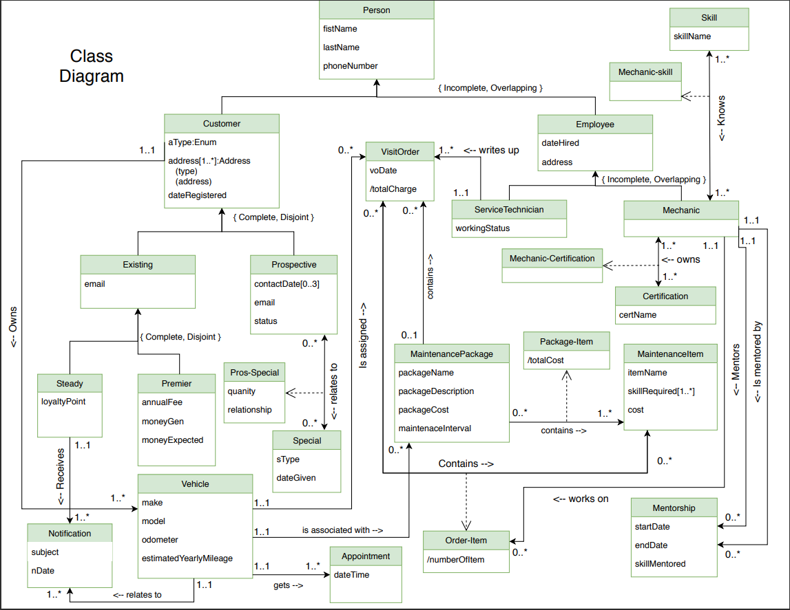

Dave's Auto Repair Database
================
Minh
2020-11-03

<br>

## 1. Background

Dave's Auto Repair is a rapidly growing auto repair shop based in 
Long Beach, California. Mechanics and technicians at Dave's Auto Repair perform 
repairs and maintenances on roughly 100 vehicles per day. Dave, the owner of the shop, 
believes that moving the shop's data to a database could help increase the month-to-month
performance of the shop. A team was hired to design a database, provide 5 table views and 
perform 15 queries.

### Team Members

-   Joshua Warejko
-   Daniel Sanchez
-   Minh Pham
-   Nhi Nguyen

### The following is a check-list for all the required documentation:
* Class diagram. 
* English description of all classes and associations:
* Denormalization paragraph(s)
* English description of all attributes
* The relation scheme, based on the design
* DDL used to create all the tables
* DML used to insert the data
* Queries to produce the reports, as described below
* Sample output of each of the queries

<br><br>

## 2. Objective
After finalizing the design for the database, the team needs to 
provide 5 table views and perform 15 queries to obtain information needed
by the shop.

### Views
1.   Customer_v – for each customer, indicate his or her name as well as the customer type (prospect, steady or premier) as well as the number of years that customer has been with us.
 
2.   Customer_addresses_v – for each customer, indicate whether they are an individual or a corporate account, and display all of the addresses that we are managing for that customer.
 
3.   Mechanic_mentor_v – reports all of the mentor/mentee relationships at Dave’s, sorted by the name of the mentor, then the name of the mentee.
 
4.   Premier_profits_v – On a year by year basis, show the premier customer’s outlay versus what they would have been charged for the services which they received had they merely been steady customers.
 
5.   Prospective_resurrection_v – List all of the prospective customers who have had three or more contacts, and for whom the most recent contact was more than a year ago.  They might be ripe for another attempt.

### Queries
1.   List the customers.  For each customer, indicate which category he or she fall into, and his or her contact information.
 
2.   For each service visit, list the total cost to the customer for that visit.
 
3.   List the top three customers in terms of their net spending for the past two years, and the total that they have spent in that period.
 
4.   Find all of the mechanics who have three or more skills. 
 
5.   Find all of the mechanics who have three or more skills in common.
 
6.   For each maintenance package, list the total cost of the maintenance package, as well as a list of all of the maintenance items within that package.
 
7.   Find all of those mechanics who have one or more maintenance items that they lacked one or more of the necessary skills.
 
8.   List the customers, sorted by the number of loyalty points that they have, from largest to smallest.
 
9.   The premier customers and the difference between what they have paid in the past year, versus the services that they actually used during that same time.  List from the customers with the largest difference to the smallest.
 
10.  Report on the steady customers based on the net profit that we have made from them over the past year, and the dollar amount of that profit, in order from the greatest to the least.
 
11.  List the three services that we have performed the most in the last year and how many times they were performed.
 
12.  List the three services that have brought in the most money in the last year along with that amount of money.
 
13.  Find the mechanic who is mentoring the most other mechanics.  List the skills that the mechanic is passing along to the other mechanics.
 
14.  Find the three skills that have the fewest mechanics who have those skills.
 
15.  List the employees who are both service technicians as well as mechanics.
 
16.  Four additional queries.
* List all appointments associated with each vehicle order by closest date first
* List all customers with a vehicle that has more than 10,000 miles, sorted by number of  miles from largest to smallest.
* List the top three customers in terms of their number of visits for the past two years, and the total number of visits they have made in that period.
* List all the service technicians, their working status, and the number of visit order they were part of for the past year.

<br><br>

## 3. Class Diagram 



<br><br>

## 4. Class Definitions 
Person: A human being regarded as an individual. 

Customer: A customer is any person or corporation who has paid for our services or who we think might pay for our services in the future. 

Existing: A current customer who has paid for our services.

Steady: A customer who signed up for our preventative maintenance E-mail notifications and are likely to come in for routine maintenance.  

Premier: A customer who signed up to pay an annual fee in monthly installments for their preventative maintenance. 

Prospective: A referred person (by our current steady/premier customers) who is not currently paying for our services but may in the future.

Employee: Any person who is getting paid to work for a corporation.

Service Technician: An employee who writes up maintenance visit orders each time a customer comes in. They capture the maintenance items and assign appropriate mechanics to customers. The service technician can be a mechanic.

Mechanic: An employee who repairs and maintains the vehicles.

Notification: An email sent or received from/to a steady customer.

Appointment: An arrangement to meet someone at a particular time. 

Vehicle: A thing used for transporting people on land such as a car or truck.

Visit Order: An arrangement between a customer and a service technician of the maintenance items for a vehicle that a customer brings in.

Maintenance Item: A specific vehicle part that needs preventative maintenance.

Maintenance Package: A set of maintenance items.

Order-Item: An association between a visit order and a maintenance item.

Package-Item: An association between a Maintenance Package and a Maintenance Item.

Mentorship: A relationship in which a more experienced or more knowledgeable person helps to guide a less experienced or less knowledgeable person.

<br><br>

## 5. Associations
A Person is or is not a Customer.
A Customer is a Person.

A Person is or is not an Employee.
An Employee is a Person.

A Customer is or is not an Existing.
An Existing is a Customer.

A Customer is or is not a Prospective.
A Prospective is a Customer.

An Existing is or is not a Steady.
A Steady is an Existing.

An Existing is or is not a Premier.
A Premier is an Existing.

A Steady receives one to many Notifications.
A Notification is received by one and only one Steady.

An Employee is or is not a Service Technician.
A Service Technician is an Employee.

An Employee is or is not a Mechanic.
A Mechanic is an Employee.

A Customer owns one to many Vehicles.
A Vehicle is owned by one and only one Customer.

A Vehicle gets one to many Appointments.
An Appointment is given to one and only one Vehicle.

A Steady receives one to many Notifications.
A Notification is received by one and only one Steady.

A Prospective relates to zero to many Pros-Specials.
A Pros-Special is related to one and only one Prospective.
A Special relates to zero to many Pros-Specials.
A Pros-Special relates to one and only one Special.

A Vehicle relates to one to many Notifications.
A Notification is related to one and only one Vehicle.

A Vehicle is associated with zero to many MaintenancePackages.
A MaintenancePackage is associated to one and only one Vehicle.

A Visit Order contains zero to many Order-Items.
An Order-Item is contained in one and only one Visit Order.
A Maintenance Item contains zero to many Order-Items.
An Order-Item is contained in one and only one Maintenance Item.

A Service Technician writes one to many Visit Orders.
A Visit Order is written by one and only one Service Technician.

A Vehicle is assigned zero to many Visit Orders. 
A Visit Order is assigned to one and only one Vehicle. 

A Mechanic works on zero to many Order-Items.
An Order-Item is worked by one and only one Mechanic.

A Mechanic mentors zero to many Mentorships.
A Mentorship is mentored by one and only one Mechanic.

A Maintenance Package contains zero to many Package-Items.
A Package-Item is contained by one and only one Maintenance Packages.
A Maintenance Item is contained by one to many Package-Items.
A Package-Item contains one and only one Maintenance Item.

A Mechanic knows one to many mechanic-skill.
A Mechanic-skill is known by one and only one mechanic.
A Skill knows one to many Mechanic-skills.
A Mechanic-skill is known by one and only one Skill.

A Mechanic owns one to many Mechanic-Certifications.
A Mechanic-Certification is owned by one and only one Mechanic.
A Certification owns one to many Mechanic-Certifications.
A Mechanic-Certification is owned by one and only one Certification.

<br><br>
## 6. Denormalization
We did not do any denormalization in our design. The max number of tables we have to go through to reach a certain data is five. We believe this won’t do much to slow down our database queries.

<br><br>
## 7. Description of Attributes
### People
* firstName: a personal designation given to someone at birth and used before a family name.
* lastName: a family name
* phoneNumber: a series of numbers that you press on a telephone in order to call someone.

### Customer
* dateRegistered: the day a customer brought his vehicle for the first time for maintenance.
* address: the particulars of the place where a customer lives.
* aType: it indicates if a customer is a private individual or a corporation.

### Existing
* email: messages distributed by electronic means from one computer user to one or more recipients via a network.

### Prospective
* contactDate: the time and day we attempted to contact a prospective customer.
* email: messages distributed by electronic means from one computer user to one or more recipients via a network.
* status: it indicates whether a prospective customer can still become a customer or not.

### Pros-Special
Quantity: the number of special given
Relationship: contact information on their friend/relative from existing customer

### Special 
* sType: the type of special we give to our steady or premier customer.
* dateGiven: the date the special was given to the customer.

### Steady 
* loyaltyPoint: points that the customer receives for spending with us.

### Premier 
* annualFee: the amount that the premier customer pay for their yearly services
* moneyGen: the total money we generated from this premier customer.
* moneyExpected: the total money paid if this premier customer was a steady customer.

### Vehicle 
* make: the manufacturer of the vehicle.
* model: the brand of vehicles sold by a manufacturer.
* odometer: instrument used to measure distance traveled by a vehicle.
* estimatedYearlyMileage: an estimation of the numbers of miles that the customer will put on the vehicle each year.

### Notification 
* subject: the header that gives the key detail of the notification.
* nDate: the date the notification was sent.

### Appointment 
* dateTime: the day and time we expect the customer to be at our shop.

### Employee 
* dateHired: the day an employee became part of Dave’s Automotive.
* address: the particulars of the place where an employee lives.

### Service Technician 
* workingStatus: a classification of service technician as either full time or part time.

### Mentorship 
* startDate: the date that the mentor relationship started.
* endDate: the date that the mentor relationship ended.
* skillMentored: the ability relating to automotive that was taught during the mentor relationship.

### Skill 
* skillName:  the name of an ability relating to automotive.

### Certification 
* certName: the name of a accomplishment given by an organization.

### VisitOrder 
* voDate: the date the visit order was given.
* totalCharge: a calculated cost of the visit order.

### MaintenancePackage 
* packageName: the name of the group of maintenance items.
* packageDescription: a written representation of the group of maintenance items.
* packageCost: the total price of the group of maintenance items.
* maintenanceInterval: the mileage that a customer is expected to bring his/her vehicle in for maintenance.

### Package-Item 
* totalCost: the total cost of all the items included within the package.

### MaintenanceItem 
* itemName: the name of the maintenance item.
* skillRequired: the skill the mechanic needs in order to operate on a maintenance item. 
* cost: the cost of a maintenance item.

### Order-Item 
* numberOfItem: a calculated value of the total number of maintenance items in a visit order.

<br><br>

## DDL & DML
Visit the main branch of the repository to view the [DDL](DDL.sql) and [DML](DML.sql) files.

<br><br>

## 8. Views
1. Customer_v – for each customer, indicate his or her name as well as the customer type (prospect, steady or premier) as well as the number of years that customer has been with us.
```sql
CREATE VIEW Customer_v AS
(select firstname,lastname, 'Steady' as type,2016-year(dateregistered) AS yearwithus from person p 
inner join customer c on p.PERSONID = c.PERSONID
inner join steady_customer s 
on s.CUSTOMERID = c.CUSTOMERID)
UNION
(select firstname,lastname, 'Premier' as type,2016-year(dateregistered) AS yearwithus from person p 
inner join customer c on p.PERSONID = c.PERSONID
inner join premier_customer r 
on r.CUSTOMERID = c.CUSTOMERID)
UNION 
(select firstname,lastname, 'Prospective' as type,2016-year(dateregistered) AS yearwithus from person p 
inner join customer c on p.PERSONID = c.PERSONID
inner join prospective_customer d 
on d.CUSTOMERID = c.CUSTOMERID);

```
#### Output
| FIRSTNAME	| LASTNAME	| TYPE	| YEARWITHUS
| --- | --- | --- | --- |
| Bridgette	| Storm		| Prospective	| 0 |
| Chris	| Zemke	| Steady | 0 |
| Hank | Schrader	| Premier |	1 |
| Jane | Whip	|	Prospective	| 1 |
| John | Bridge	| Steady |	0 |
| Mike	|	Yin	| Prospective	| 1 |
| Sarah	|	Whethers	| Steady | 2 |
| Zack	|	Maldonado	| Premier |	0 |

<br>

2. Customer_addresses_v – for each customer, indicate whether they are an individual or a corporate account, and display all of the addresses that we are managing for that customer.
```sql
CREATE VIEW Customer_addresses_v AS
SELECT customer.customerid,customer.atype,address
FROM customer inner join address
on customer.customerid = address.customerid;
```
#### Output
| CUSTOMERID | ATYPE | ADDRESS |
| --- | --- | --- |
| c01	|	private	|	1234 Cantberry Way, CA 92244 |
| c02	|	private	|	415 Baronet, Mission Viejo, CA 92692 |
| c03	|	private	|	10 Roberts, Coto de Caza, CA 92604 |
| c04	|	corporation	| 8 Rancho Circle, Lake Forest, CA 92622 |
| c04	|	corporation	| 1 Tudor Way, Ladera Ranch, CA 92604 |
| c04	|	corporation	| 27702 The Way, Ocean Ranch, CA 92699 |
| c05	|	private	|	1456 Man Street, Porland, OR 92213 |
| c06	|	corporation	| 8496 Cambridge St. Baldwin Park, CA 91706 |
| c06	|	corporation	| 9524 Oak St. Laguna Niguel, CA 92677 |
| c07	|	private	|	8344 Heather St. San Francisco, CA 94109 |
| c08	|	corporation	| 9606 Branch Lane Tustin, CA 92780 |
| c08	|	corporation	| 844 Honey Creek St. Huntington Park, CA 90255 |
| c08	|	corporation	| 73 Myrtle Dr. Sacramento, CA 95823 |
| c08	|	corporation	| 9027 Bay St. Long Beach, CA 90813 |

<br>

3. Mechanic_mentor_v – reports all of the mentor/mentee relationships at Dave’s, sorted by the name of the mentor, then the name of the mentee.
```sql
CREATE VIEW Mechanic_mentor_v AS
 SELECT MTR.EMPLOYEEID AS Mentor_ID, pMTR.LASTNAME AS Mentor_LastName, 
  pMTR.FIRSTNAME AS Mentor_FirstName, MTE.EMPLOYEEID AS Mentee_ID, 
   pMTE.LASTNAME AS Mentee_LastName, pMTE.FIRSTNAME AS Mentee_FirstName, 
    MTHP.STARTDATE, MTHP.ENDDATE,  MTHP.SKILLMENTORED FROM 
     person pMTR INNER JOIN employee E ON pMTR.PERSONID = E.PERSONID 
      INNER JOIN mechanic MTR ON MTR.EMPLOYEEID = E.EMPLOYEEID 
       INNER JOIN (person pMTE INNER JOIN employee EE ON 
        pMTE.PERSONID = EE.PERSONID INNER JOIN mentorship 
         MTHP ON MTHP.MENTEEID = EE.EMPLOYEEID 
          INNER JOIN mechanic MTE ON MTHP.MENTEEID = 
           MTE.EMPLOYEEID) ON MTR.EMPLOYEEID = MTHP.EMPLOYEEID
            ORDER BY pMTR.LASTNAME, pMTE.LASTNAME;
```

#### Output 
| MENTOR_ID	| MENTOR_LASTNAME |	MENTOR_FIRSTNAME	| MENTEE_ID	| MENTEE_LASTNAME	| MENTEE_FIRSTNAME	| STARTDATE	| ENDDATE	| SKILLMENTORED |
| --- | --- | --- | --- | --- | --- | --- | --- | --- | 
| e05	| Hancock | Stewart	| e06	| Rayn	| Paul	| 2016-11-01	| 2016-12-28	| Air Filter |
| e04	| Johnson	| Jake	| e05	| Hancock | Stewart	| 2016-03-01	| 2016-06-28	| Brakes |
| e02	| Mukasa	| Winston	| e04	| Johnson	| Jake	| 2016-01-10	| 2016-03-01	| Hoist Operation |
| e02	| Mukasa	| Winston	| e06	| Rayn	| Paul	| 2016-09-03	| 2016-11-03	| Oil Change |
| e02	| Mukasa	| Winston	| e03	| Reigns	| Ryan	| 2015-06-05	| 2015-07-20	| Oil Change |
| e03	| Reigns | Ryan	| e02	| Mukasa | Winston	| 2016-01-01	| 2016-05-28	| Timing Belts |

<br>
4. Premier_profits_v – On a year by year basis, show the premier customer’s outlay versus what they would have been charged for the services which they received had they merely been steady customers.

```sql
CREATE VIEW Premier_profits_v AS
SELECT c.CUSTOMERID,firstname,lastname,(2017-year(c.DATEREGISTERED))*annualfee as outlay,sum(cost) as steadytotal
from order_item o 
inner join visit_order v
on v. VISITID = o.VISITID 
inner join maintenance_item m 
on m.ITEMID = o.ITEMID
inner join vehicle e
on e.VEHICLEID = v.VEHICLEID
inner join customer c
on c.CUSTOMERID = e.CUSTOMERID
inner join premier_customer r
on r.CUSTOMERID = c.CUSTOMERID
inner join person p
on p.PERSONID = c.PERSONID
group by c.CUSTOMERID, firstname,lastname,(2017-year(c.DATEREGISTERED))*annualfee;
```

#### Output
|  CUSTOMERID | FIRSTNAME | LASTNAME | OUTLAY | STEADYTOTAL |
| --- | --- | --- | --- | --- |
|  c03 | Hank | Schrader | 2000 | 1175 |
|  c06 | Zack | Maldonado | 850 | 1130 |

<br>
5. Prospective_resurrection_v – List all of the prospective customers who have had three or more contacts, and for whom the most recent contact was more than a year ago.  They might be ripe for another attempt.

```sql
CREATE VIEW Prospective_resurrection_v AS
 SELECT c.CUSTOMERID, p.FIRSTNAME, p.LASTNAME, COUNT(c.CUSTOMERID) AS 
  number_of_contacts FROM person p INNER JOIN customer c ON 
   p.PERSONID = c.PERSONID INNER JOIN prospective_customer pr ON 
    pr.CUSTOMERID = c.CUSTOMERID INNER JOIN contact_made cm ON 
     cm.CUSTOMERID = pr.CUSTOMERID WHERE 2016-YEAR(contactDate) >= 1 
      GROUP BY p.FIRSTNAME, p.LASTNAME, c.CUSTOMERID
       HAVING COUNT(c.CUSTOMERID) >= 3;
```

#### Output
| CUSTOMERID | FIRSTNAME | LASTNAME | NUMBER_OF_CONTACTS |
| --- | --- | --- | --- |
| c07 | Mike | Yin | 3 |

<br><br>
## 9. Queries
1. List the customers.  For each customer, indicate which category he or she fall into, and his or her contact information.

```sql
(select firstname,lastname, 'Steady' as type,c.atype,address from person p 
inner join customer c on p.PERSONID = c.PERSONID
inner join steady_customer s 
on s.CUSTOMERID = c.CUSTOMERID
inner join (select address.* from address
inner join (
select max(address) as maxID from address group by customerid) maxID
on maxID.maxID = address.address) a
on a.customerid = c.customerid)
UNION
(select firstname,lastname, 'Premier' as type,c.atype,address from person p 
inner join customer c on p.PERSONID = c.PERSONID
inner join premier_customer r 
on r.CUSTOMERID = c.CUSTOMERID
inner join (select address.* from address
inner join (
select max(address) as maxID from address group by customerid) maxID
on maxID.maxID = address.address) a
on a.customerid = c.customerid)
UNION 
(select firstname,lastname, 'Prospective' as type,c.atype,address from person p 
inner join customer c on p.PERSONID = c.PERSONID
inner join prospective_customer d 
on d.CUSTOMERID = c.CUSTOMERID
inner join (select address.* from address
inner join (
select max(address) as maxID from address group by customerid) maxID
on maxID.maxID = address.address) a
on a.customerid = c.customerid);
```

#### Output
| FIRSTNAME | LASTNAME | TYPE | ATYPE | ADDRESS |
| --- | --- | --- | --- | --- |
| Chris | Zemke | Steady  | corporation | 9606 Branch Lane Tustin, CA 92780 |
| Hank | Schrader | Premier   | private |         10 Roberts, Coto de Caza, CA 92604 |
| Jane | Whip | Prospective | private |         415 Baronet, Mission Viejo, CA 92692 |
| John | Bridge | Steady      | private |         1234 Cantberry Way, CA 92244 |
| Mike | Yin | Prospective | private |         8344 Heather St. San Francisco, CA 94109 |
| Sarah | Whethers | Steady      | private |         1456 Man Street, Porland, OR 92213 |
| Zack | Maldonado | Premier     | corporation | 9524 Oak St. Laguna Niguel, CA 92677 |
<br>
2. For each service visit, list the total cost to the customer for that visit.

```sql
select o.VISITID,c.CUSTOMERID, firstname,lastname,count(*) as items, sum(cost) as total
from order_item o 
inner join visit_order v 
on v. VISITID = o.VISITID 
inner join maintenance_item m 
on m.ITEMID = o.ITEMID
inner join vehicle e
on e.VEHICLEID = v.VEHICLEID
inner join customer c
on c.CUSTOMERID = e.CUSTOMERID
inner join person p
on p.PERSONID = c.PERSONID
group by o.VISITID,o.VISITID,c.CUSTOMERID, firstname,lastname
order by o.visitid asc;
```

#### Output
| VISITID | CUSTOMERID | FIRSTNAME | LASTNAME | ITEMS | TOTAL |
| --- | --- | --- | --- | --- | --- |
| o02 | c01 | John | Bridge | 2 | 95 |
| o03 | c05 | Sarah | Whethers | 3 | 680 |
| o04 | c08 | Chris | Zemke | 3 | 495 |
| o05 | c07 | Mike | Yin | 2 | 180 |
| o06 | c04 | Bridgette | Storm | 1 | 400 |
| o07 | c02 | Jane | Whip | 1 | 500 |
| o08 | c08 | Chris | Zemke | 1 | 500 |
| o09 | c08 | Chris | Zemke | 1 | 65 |
| o10 | c08 | Chris | Zemke | 1 | 65 |
| o11 | c05 | Sarah | Whethers | 1 | 40 |
| o12 | c05 | Sarah | Whethers | 1 | 150 |
| o13 | c05 | Sarah | Whethers | 1 | 65 |
| o14 | c05 | Sarah | Whethers | 1 | 65 |
| o15 | c05 | Sarah | Whethers | 1 | 500 |
| o16 | c01 | John | Bridge | 1 | 65 |
| o17 | c01 | John | Bridge | 2 | 215 |
| o18 | c01 | John | Bridge | 1 | 65 |
| o19 | c06 | Zack | Maldonado | 1 | 65 |
| o20 | c06 | Zack | Maldonado | 1 | 500 |
| o21 | c06 | Zack | Maldonado | 1 | 65 |
| o22 | c06 | Zack | Maldonado | 1 | 500 |
| o23 | c03 | Hank | Schrader | 1 | 30 |
| o24 | c03 | Hank | Schrader | 1 | 150 |
| o25 | c03 | Hank | Schrader | 2 | 465 |
| o26 | c03 | Hank | Schrader | 1 | 65 |
| o27 | c03 | Hank | Schrader | 2 | 465 |

<br>
3. List the top three customers in terms of their net spending for the past two years, and the total that they have spent in that period.

```sql
SELECT c.CUSTOMERID,firstname,lastname, sum(cost) as total
from order_item o 
inner join (select * from visit_order v 
where v.VODATE between '2014-12-03' and '2016-12-03') v
on v. VISITID = o.VISITID 
inner join maintenance_item m 
on m.ITEMID = o.ITEMID
inner join vehicle e
on e.VEHICLEID = v.VEHICLEID
inner join customer c
on c.CUSTOMERID = e.CUSTOMERID
inner join person p
on p.PERSONID = c.PERSONID
group by c.CUSTOMERID, firstname,lastname
order by total desc
```

#### Output
| CUSTOMERID | FIRSTNAME | LASTNAME | TOTAL |
| --- | --- | --- | --- |
| c05 | Sarah | Whethers | 1500 |
| c03 | Hank | Schrader | 1175 |
| c06 | Zack | Maldonado | 1130 |

<br>
4. Find all of the mechanics who have three or more skills.

```sql
SELECT firstName, lastName, COUNT(*) AS number_of_skills
from person NATURAL JOIN employee NATURAL JOIN mechanic_skill GROUP BY firstName, lastName HAVING count(*) > 2;
```

#### Output
| FIRSTNAME | LASTNAME | NUMBER_OF_SKILLS |
| --- | --- | --- |
| Jake | Johnson | 3 |
| Paul | Rayn | 5 |
| Ryan | Reigns | 5 |
| Stewart | Hancock | 4 |
| Winston | Mukasa | 4 |

<br>
5. Find all of the mechanics who have three or more skills in common.

```sql
select * from (select 'e02' as employeeid1, 'e03' as employeeid2, count(*) as commonskills from (select s.skillname,count(times) as times from 
(select skillname, count(skillname) as times from mechanic_skill
where employeeid in ('e02','e03')
group by skillname) s
where s.times = 2
group by s.skillname) a
UNION 
(select 'e02' as employeeid1, 'e04' as employeeid2, count(*) as commonskills from (select s.skillname,count(times) as times from 
(select skillname, count(skillname) as times from mechanic_skill
where employeeid in ('e03','e4')
group by skillname) s
where s.times = 2
group by s.skillname) a)
UNION 
(select 'e02' as employeeid1, 'e06' as employeeid2, count(*) as commonskills from (select s.skillname,count(times) as times from 
(select skillname, count(skillname) as times from mechanic_skill
where employeeid in ('e03','e06')
group by skillname) s
where s.times = 2
group by s.skillname) a)
UNION
(select 'e05' as employeeid1, 'e06' as employeeid2, count(*) as commonskills from (select s.skillname,count(times) as times from 
(select skillname, count(skillname) as times from mechanic_skill
where employeeid in ('e05','e06')
group by skillname) s
where s.times = 2
group by s.skillname) a)
UNION 
(select 'e04' as employeeid1, 'e06' as employeeid2, count(*) as commonskills from (select s.skillname,count(times) as times from 
(select skillname, count(skillname) as times from mechanic_skill
where employeeid in ('e04','e06')
group by skillname) s
where s.times = 2
group by s.skillname) a)) b 
where commonskills > 2;
```

#### Output
| EMPLOYEEID1 | EMPLOYEEID2 | COMMONSKILLS |
| --- | --- | --- |
| e02 | e03 | 3 |
| e02 | e06 | 4 |

<br>
6. For each maintenance package, list the total cost of the maintenance package, as well as a list of all of the maintenance items within that package.

```sql
select m.PACKAGEID,packagedescription as maintenanceitems,sum(i.COST) as total
from package_item p
inner join maintenance_package m
on m.PACKAGEID = p.PACKAGEID
inner join maintenance_item i
on i.ITEMID = p.ITEMID
group by m.packageid,packagedescription;
```

#### Output
| PACKAGEID | MAINTENANCEITEMS | TOTAL |
| --- | --- | --- |
| mp01 | Tire Rotation, Oil Change | 95 |
| mp02 | Oil Change, air filters | 105 |
| mp03 | Tire Rotation, Brakes | 180 |

<br>
7. Find all of those mechanics who have one or more maintenance items that they lacked one or more of the necessary skills.

```sql
select m.employeeid,firstname,lastname,phonenumber from mechanic_skill m
inner join employee e
on e.EMPLOYEEID = m.EMPLOYEEID
inner join person p
on p.PERSONID = e.PERSONID
where m.SKILLNAME not in (select skillrequired from maintenance_item)
group by m.employeeid,firstname,lastname,phonenumber;
```

#### Output
| EMPLOYEEID | FIRSTNAME | LASTNAME | PHONENUMBER |
| --- | --- | --- | --- |
| e02 | Winston | Mukasa | (949) 353-6854 |
| e03 | Ryan | Reigns | (949) 415-9874 |
| e04 | Jake | Johnson | (949) 412-8572 |
| e05 | Stewart | Hancock | (714) 736-8643 |
| e06 | Paul | Rayn | (949) 234-6543 |

<br>
8. List the customers, sorted by the number of loyalty points that they have, from largest to smallest.

```sql
SELECT firstName, lastName, loyaltyPoints FROM person 
NATURAL JOIN customer NATURAL JOIN steady_customer ORDER BY loyaltyPoints DESC;
```

#### Output
| FIRSTNAME | LASTNAME | LOYALTYPOINTS |
| --- | --- | --- |
| John | Bridge | 200 |
| Chris | Zemke | 150 |
| Sarah | Whethers | 100 |

<br>
9. The premier customers and the difference between what they have paid in the past year, versus the services that they actually used during that same time.  List from the customers with the largest difference to the smallest.

```sql
SELECT c.CUSTOMERID,firstname,lastname,annualfee as actualpay,sum(cost) as shouldpay,annualfee-sum(cost) as difference
from order_item o 
inner join (select * from visit_order where VODATE between '2015-12-03' and '2016-12-03') v
on v. VISITID = o.VISITID 
inner join maintenance_item m 
on m.ITEMID = o.ITEMID
inner join vehicle e
on e.VEHICLEID = v.VEHICLEID
inner join customer c
on c.CUSTOMERID = e.CUSTOMERID
inner join premier_customer r
on r.CUSTOMERID = c.CUSTOMERID
inner join person p
on p.PERSONID = c.PERSONID
group by c.CUSTOMERID, firstname,lastname,annualfee
order by difference desc;
```

#### Output
| CUSTOMERID | FIRSTNAME | LASTNAME | ACTUALPAY | SHOULDPAY | DIFFERENCE |
| --- | --- | --- | --- | --- | --- |
| c06 | Zack | Maldonado | 850 | 565 | 285 |
| c03 | Hank | Schrader | 1000 | 1145 | -145 |

<br>
10. Report on the steady customers based on the net profit that we have made from them over the past year, and the dollar amount of that profit, in order from the greatest to the least.

```sql
SELECT c.CUSTOMERID,firstname,lastname,sum(cost) as netprofit,sum(cost)*.25 as profit
from order_item o 
inner join (select * from visit_order where VODATE between '2015-12-03' and '2016-12-03') v
on v. VISITID = o.VISITID 
inner join maintenance_item m 
on m.ITEMID = o.ITEMID
inner join vehicle e
on e.VEHICLEID = v.VEHICLEID
inner join customer c
on c.CUSTOMERID = e.CUSTOMERID
inner join steady_customer s
on s.CUSTOMERID = c.CUSTOMERID
inner join person p
on p.PERSONID = c.PERSONID
group by c.CUSTOMERID, firstname,lastname
order by profit desc;
```

#### Output
| CUSTOMERID | FIRSTNAME | LASTNAME | NETPROFIT | PROFIT |
| --- | --- | --- | --- | --- |
| c01 | John | Bridge | 1055 | 263.75 |
| c05 | Sarah | Whethers | 780 | 195.00 |

<br>
11. List the three services that we have performed the most in the last year and how many times they were performed. 

```sql
select m.ITEMNAME as service,count(o.itemid) as timesperformed from (select * from visit_order v
inner join order_item o
on v.VISITID = o.VISITID where v.VODATE between '2015-12-03' and '2016-12-03') o
inner join maintenance_item m
on o.ITEMID = m.ITEMID
group by m.ITEMNAME
order by timesperformed desc
fetch next 3 row only;
** Another way to do the same thing in derby, not sure if it works in mysql **
select m.ITEMNAME as service,count(o.itemid) as timesperformed from visit_order v
inner join order_item o
on v.VISITID = o.VISITID 
inner join maintenance_item m
on o.ITEMID = m.ITEMID
where v.VODATE between '2015-12-03' and '2016-12-03'
group by m.ITEMNAME
order by timesperformed desc
limit 3;
```

#### Output
| SERVICE | TIMESPERFORMED |
| --- | --- |
| Oil Change | 11 |
| Brakes | 5 |
| Timing Belts | 3 |

<br>
12. List the three services that have brought in the most money in the last year along with that amount of money.

```sql
select m.ITEMNAME as service,count(o.itemid) as timesperformed, sum(cost) as total from (select * from visit_order v
inner join order_item o
on v.VISITID = o.VISITID where v.VODATE between '2015-12-03' and '2016-12-03') o
inner join maintenance_item m
on o.ITEMID = m.ITEMID
group by m.ITEMNAME
order by timesperformed desc
limit 3;
```

#### Output
| SERVICE | TIMESPERFORMED | TOTAL |
| --- | --- | --- |
| Oil Change | 11 | 715 |
| Brakes | 5 | 750 |
| Timing Belts | 3 | 1200 |

<br>
13. Find the mechanic who is mentoring the most other mechanics.  List the skills that the mechanic is passing along to the other mechanics.

```sql
select firstname,lastname,count(m.EMPLOYEEID) as numberofmentee,m.SKILLMENTORED from mentorship m
inner join employee e
on e.EMPLOYEEID = m.EMPLOYEEID
inner join person p
on p.PERSONID = e.PERSONID
group by firstname,lastname,m.SKILLMENTORED
order by numberofmentee desc
limit 2;
```

#### Output
| FIRSTNAME | LASTNAME | NUMBEROFMENTEE | SKILLMENTORED |
| --- | --- | --- | --- |
| Winston | Mukasa | 2 | Oil Change |
| Winston | Mukasa | 1 | Hoist Operation |


<br>
14. Find the three skills that have the fewest mechanics who have those skills.

```sql
SELECT skillName, count(*) AS Skill_Occurance FROM person 
NATURAL JOIN employee NATURAL JOIN mechanic NATURAL JOIN mechanic_skill 
GROUP BY skillName 
ORDER BY count(*) OFFSET 0 ROWS 
limit 3;
```
#### Output
| SKILLNAME | SKILL_OCCURANCE |
| --- | --- |
| Timing Belts | 1 |
| Ring Operation | 1 |
| Hoist Operation | 1 |

<br>
15. List the employees who are both service technicians as well as mechanics.

```sql
SELECT firstName, lastName, employeeId FROM person 
NATURAL JOIN employee NATURAL JOIN service_technician NATURAL JOIN mechanic;
```

#### Output
| FIRSTNAME | LASTNAME | EMPLOYEEID |
| --- | --- | --- |
| Ryan | Reigns | e03 |
